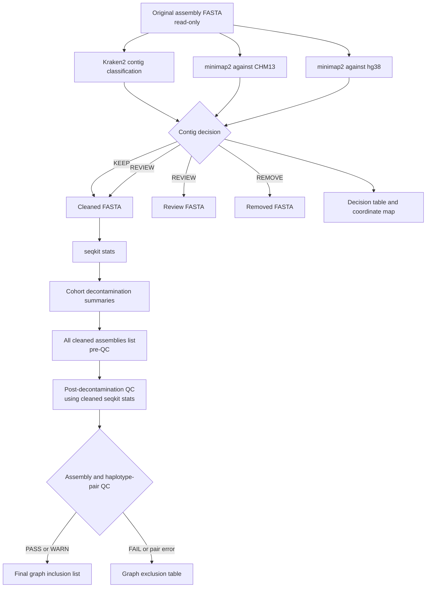

# Decontamination workflow: process and file lifecycle

This document explains the decontamination implemented in this repository,
including the post-decontamination QC that decides which cleaned assemblies are
used for pangenome construction. It describes the current code, not a generic
Kraken2 workflow.

Implementation sources:

- [`config/config.yaml`](config/config.yaml): paths, thresholds, and resources;
- [`workflow/rules/decontamination.smk`](workflow/rules/decontamination.smk):
  Kraken2, classification, cleaning, and cohort summaries;
- [`workflow/scripts/filter_fasta.py`](workflow/scripts/filter_fasta.py): FASTA
  filtering and contig-name mapping;
- [`workflow/scripts/summarize_decontamination.py`](workflow/scripts/summarize_decontamination.py):
  cohort summaries and the preliminary cleaned-assembly list;
- [`workflow/rules/post_decontamination_QC.smk`](workflow/rules/post_decontamination_QC.smk):
  QC of every cleaned assembly;
- [`workflow/scripts/summarize_qc.py`](workflow/scripts/summarize_qc.py): final
  PASS/WARN/FAIL and paired-haplotype decisions.

## The short version

For every discovered input assembly, the workflow:

1. keeps the original FASTA unchanged;
2. classifies every contig with Kraken2;
3. measures how much of each contig aligns to CHM13 or hg38;
4. removes a bacterial/viral contig only when human-reference support covers at
   most 10% of it;
5. retains a bacterial/viral contig for manual review when human-reference
   support covers more than 10%;
6. writes a new cleaned FASTA with assembly-prefixed contig names;
7. retains removed and review sequences in separate FASTAs for auditing;
8. reuses the cleaned SeqKit statistics to re-evaluate total length, contig N50,
   and N content; and
9. writes the final list of cleaned assemblies accepted for graph construction.

Two points are especially important:

- `REVIEW` means **retain in the cleaned FASTA and also copy to the review
  FASTA**. It does not mean remove.
- `decontamination/summary/graph_cleaned_assemblies.txt` contains every cleaned
  assembly before the second QC pass. The final graph input is
  `post_decontamination_qc/summary/graph_included_assemblies.txt`.
- Compleasm and cleaned-assembly reference realignment are not part of
  post-decontamination QC.

## Workflow overview



Kraken2 and the two reference alignments are independent jobs and can run in
parallel. They are shown in a logical order here because their results meet at
the contig-decision step.

## Inputs and current defaults

The workflow discovers all FASTA files matching `assemblies.patterns` under
`assemblies.directory`. It does **not** restrict decontamination to assemblies
that passed the first QC stage.

The important current settings are equivalent to:

```yaml
kraken:
  db: /gpfs/work3/0/qtholstg/hg38_res_v2/kraken/pluspf_20230605
  confidence: 0.0
  minimum_hit_groups: 0
  report_minimizer_data: true
  target_taxids:
    "2": bacteria
    "10239": viruses

classification:
  human_min_mapq: 5
  human_min_identity: 95.0
  remove_max_human_percent: 10.0
```

The main read-only inputs are:

- the haplotype assembly FASTAs;
- CHM13 and hg38 FASTAs;
- the Kraken2 database; and
- `config/config.yaml`.

The configured paths are server paths. Change them when moving the workflow;
do not assume that the local checkout has the same data paths.

## Step 1: discover assemblies and freeze the run inputs

Each supported FASTA suffix is stripped to create an assembly ID. For example:

```text
Input:
SAMPLE.hifi.hifiasm.bp.hap1.p_ctg.fa.gz

Assembly ID:
SAMPLE.hifi.hifiasm.bp.hap1.p_ctg
```

The workflow stops if no assemblies are found or if two paths produce the same
assembly ID. Every discovered assembly is recorded in:

```text
resources/all_assemblies.tsv
```

with this schema:

```text
assembly_id    source_path
```

It also writes:

```text
resources/resolved_classification_config.json
```

This is the exact resolved Kraken/classification configuration used by the
decision step. It makes a completed run easier to audit even if the main YAML
is edited later.

A SHA-256 hash of all assembly IDs and source paths is placed in the completion
marker name:

```text
summary/all_assemblies.<12-character-hash>.complete
```

If the discovered assembly set or a source path changes, the expected marker
name changes, so Snakemake must complete the expanded/current cohort.

## Step 2: obtain human-reference support

The decision step requires each original assembly aligned to both CHM13 and
hg38. Existing alignments under the original QC results are reused; missing
ones are generated automatically with the QC rules:

```bash
minimap2 -x asm5 --secondary=no -c -t THREADS \
  reference.mmi assembly.fa.gz \
  | gzip -c > assembly.paf.gz
```

Logical paths are:

```text
<results.qc>/alignments/CHM13/<assembly_id>.paf.gz
<results.qc>/alignments/hg38/<assembly_id>.paf.gz
```

Only PAF alignments satisfying both conditions contribute human support:

```text
mapping quality >= classification.human_min_mapq       # currently 5
alignment identity >= classification.human_min_identity # currently 95%
```

Identity is calculated as PAF matching bases divided by PAF alignment block
length. Passing **query-coordinate** intervals from CHM13 and hg38 are pooled
and merged, so overlapping alignments are not double-counted. The final value
is:

```text
human_covered_percent = 100 * merged_supported_query_bp / contig_length_bp
```

PAF query coordinates are 0-based, half-open. They are only used internally at
this stage.

This alignment is a conservative safeguard, not proof that a contig is or is
not human. Genuine human sequence that is divergent from both references can
have weak reference support.

## Step 3: classify every contig with Kraken2

For each assembly, the current default command is effectively:

```bash
kraken2 \
  --db /path/to/pluspf_20230605 \
  --threads 8 \
  --report-minimizer-data \
  --report <decontam>/kraken/<assembly_id>.report.tsv \
  --output >(gzip -c > <decontam>/kraken/<assembly_id>.contig_classification.tsv.gz) \
  --gzip-compressed \
  assembly.fa.gz
```

The compression option is selected from the input suffix. `--confidence` and
`--minimum-hit-groups` are only added when their configured values are greater
than zero.

Two different Kraken outputs are retained:

- `*.report.tsv` is the taxonomic hierarchy summary;
- `*.contig_classification.tsv.gz` has one Kraken classification record per
  FASTA contig.

The report parser accepts the standard six-column Kraken report and the
eight-column report produced by `--report-minimizer-data`. It walks the report
taxonomy tree so a species below taxid 2 inherits the `bacteria` group, and a
species below taxid 10239 inherits the `viruses` group.

The decision step verifies that every FASTA contig has exactly one Kraken
classification and that Kraken/alignment query names exist in the FASTA.

## Step 4: assign KEEP, REMOVE, or REVIEW

The exact current decision table is:

| Kraken result | Merged CHM13/hg38 support | Decision | Result |
|---|---:|---|---|
| Bacterial or viral target lineage | `<= 10%` | `REMOVE` | Whole contig is removed from the cleaned FASTA |
| Bacterial or viral target lineage | `> 10%` | `REVIEW` | Whole contig stays in the cleaned FASTA and is copied to the review FASTA |
| Classified outside target lineages | any value | `KEEP` | Whole contig stays in the cleaned FASTA |
| Unclassified by Kraken2 | any value | `KEEP` | Whole contig stays in the cleaned FASTA |

In pseudocode:

```python
if kraken_group in {"bacteria", "viruses"}:
    if human_covered_percent <= 10.0:
        decision = "REMOVE"
    else:
        decision = "REVIEW"
else:
    decision = "KEEP"
```

The boundary is inclusive: exactly 10% human coverage is `REMOVE`.

Only bacterial and viral lineages are targets in the current configuration.
Fungi, protists, vectors, adapters, or other contaminant types are not removed
unless their taxids are added to `kraken.target_taxids` and are represented in
the Kraken database/report.

### Meaning of the decision-table metrics

For a bacterial/viral Kraken call, the current implementation treats the call
as a whole-contig classification:

```text
nonhuman_covered_bp              = contig length
nonhuman_covered_percent         = 100
largest_nonhuman_block_bp        = contig length
nonhuman_hit_count               = 1
best_nonhuman_identity_percent   = 0
```

These values do not describe localized Kraken matches. The
`best_nonhuman_identity_percent` and split-related columns are legacy-compatible
fields, not BLAST evidence in the current workflow.

For non-target or unclassified contigs, the corresponding non-human values are
zero and the decision is `KEEP`.

## Step 5: write per-contig decision files

For each assembly, classification produces:

```text
decisions/<assembly_id>.contigs.tsv
decisions/<assembly_id>.remove_contigs.txt
decisions/<assembly_id>.review_contigs.txt
decisions/<assembly_id>.split_nonhuman.bed
```

`*.contigs.tsv` is the authoritative audit table. It contains the contig
length, decision, human-support metrics, target group, taxid-derived reason,
and compatibility fields.

The two text lists contain only contig identifiers for their respective
decisions. They are convenience/audit outputs; FASTA filtering uses the full
decision TSV.

The current Kraken classifier never emits `SPLIT`, so
`*.split_nonhuman.bed` is created as a zero-byte file. The downstream FASTA
filter still supports `SPLIT` for compatibility with an older/localized-hit
classifier. If it is ever used:

- BED intervals are 0-based, half-open;
- matching intervals go to the removed FASTA; and
- their complement is written as renamed clean fragments.

## Step 6: create cleaned, removed, and review FASTAs

`filter_fasta.py` reads the original FASTA and decision table and creates four
outputs without modifying the source assembly:

```text
cleaned/<assembly_id>.clean.fa.gz
removed/<assembly_id>.nonhuman.fa.gz
review/<assembly_id>.review.fa.gz
split_maps/<assembly_id>.split_map.tsv
```

The disposition of each current decision is:

| Decision | Cleaned FASTA | Removed FASTA | Review FASTA | Coordinate map |
|---|---|---|---|---|
| `KEEP` | full contig | no | no | one `keep` row |
| `REVIEW` | full contig | no | full contig, original header | one `review` row |
| `REMOVE` | no | full contig | no | one `removed` row |
| `SPLIT` | retained fragments | removed intervals | no | one row per retained/removed interval |

### Cleaned contig names

Every cleaned FASTA identifier is prefixed with its assembly ID so graph source
names are unique across haplotypes:

```text
Original:
>h1tg000001l description

Cleaned:
>SAMPLE.hifi.hifiasm.bp.hap1.p_ctg.h1tg000001l description
```

The first identifier token is prefixed; any description after it is retained.
Review FASTAs retain the original full header. Removed whole-contig records use
a header such as:

```text
>contig_name decision=REMOVE
```

### Coordinate map

`split_map.tsv` records how every original contig maps to the new outputs:

```text
original_contig
original_length_bp
output_contig
start_1based
end_1based
length_bp
disposition
```

Unlike BED, its coordinates are **1-based and inclusive**. A removed whole
contig has an empty `output_contig`. `KEEP` and `REVIEW` rows record the new
assembly-prefixed identifier.

The three FASTA outputs are deterministic gzip files: gzip timestamps are set
to zero and sequences are wrapped at 80 bases. Empty removed/review FASTAs are
valid gzip files containing zero FASTA records. The workflow fails instead of
publishing an empty cleaned assembly if all contigs would be removed.

## Step 7: calculate cleaned assembly statistics

Each cleaned FASTA is summarized with:

```bash
seqkit stats --all --tabular \
  <decontam>/cleaned/<assembly_id>.clean.fa.gz \
  > <decontam>/stats/<assembly_id>.clean.seqkit.tsv
```

The cohort summary waits for every stats file, ensuring that every cleaned
FASTA can be read successfully. The current decontamination summarizer does not
copy these seqkit values into `contamination_summary.tsv`; the per-assembly
stats files remain available separately.

## Step 8: create cohort-level decontamination outputs

After every assembly has decisions, a cleaned FASTA, and seqkit stats, the
workflow creates:

### `summary/contamination_summary.tsv`

One row per assembly with source/cleaned paths and counts or bases for `KEEP`,
`REVIEW`, `SPLIT`, and `REMOVE`.

With the current classifier:

- `removed_whole_contig_bp` is the sum of whole removed contigs;
- `review_bp` is the full length of retained review contigs; and
- `split_contigs` and `split_nonhuman_bp` remain zero.

### `summary/contig_actions.tsv`

All non-`KEEP` decision rows across the cohort, currently `REMOVE` and `REVIEW`,
with source and cleaned paths added. If there are no actions, this is a
header-only TSV.

### `summary/review_candidates.tsv`

The `REVIEW` subset of `contig_actions.tsv`. These contigs are still present in
the cleaned assemblies.

### `summary/graph_cleaned_assemblies.txt`

One cleaned FASTA path per discovered input assembly. This is a complete
pre-QC list, not the final graph inclusion list.

### `summary/all_assemblies.<hash>.complete`

A zero-byte success marker for the exact discovered assembly manifest.

## Step 9: re-evaluate changed sequence statistics

The post-decontamination target first validates that the preliminary cleaned
list has exactly one cleaned FASTA for every discovered assembly. It writes:

```text
<post_qc>/resources/all_cleaned_assemblies.tsv
```

The decontamination stage has already run SeqKit on every cleaned FASTA. The
post-decontamination target reads these persistent files directly:

```text
<decontam>/stats/<assembly_id>.clean.seqkit.tsv
```

It reports the cleaned contig count, total length, N50, largest contig, GC, and
N content. PASS/WARN/FAIL classification uses only total length, contig N50,
and N content. It does not require Compleasm summaries and does not remap the
cleaned assemblies to CHM13 or hg38.

This assumes that conservative removal of bacterial/viral contigs with at most
10% pooled human-reference support will not materially change primate
completeness, reference coverage, or alignment identity. A false-positive
removal containing real human sequence will not be detected by this lightweight
second pass, so the decision and review files remain important.

Per-assembly outcomes are `PASS`, `WARN`, or `FAIL`. `PASS` and `WARN`
assemblies remain eligible; `FAIL` assemblies are excluded.

Paired haplotypes are then handled as follows:

| Haplotype situation | Sample status | Final inclusion |
|---|---|---|
| both PASS | `PASS` | both |
| no FAIL, at least one WARN | `WARN` | both |
| exactly one FAIL | `PARTIAL` | only its PASS/WARN mate |
| both FAIL | `FAIL` | neither |
| missing mate or duplicate haplotype | `FAIL` | all available assemblies for that sample are excluded |

The persistent final outputs are:

```text
<post_qc>/summary/assembly_qc.tsv
<post_qc>/summary/sample_qc.tsv
<post_qc>/summary/graph_included_assemblies.txt
<post_qc>/summary/graph_excluded_assemblies.tsv
<post_qc>/summary/all_cleaned_assemblies.<hash>.complete
```

A cleaned FASTA that fails post-decontamination QC is **not deleted**. It stays
under the decontamination result directory for audit/reanalysis, but its path is
absent from the final inclusion list.

## Step 10: hand-off to graph construction

The pangenome configuration consumes:

```yaml
pangenome:
  assemblies:
    included_list: ../whole_pangenome/assembly_qc_decontaminated/results/summary/graph_included_assemblies.txt
```

Therefore the list to use for Minigraph/pangenome construction is:

```text
<results.post_decontamination_qc>/summary/graph_included_assemblies.txt
```

Do not substitute the similarly named list in the decontamination directory;
that earlier list includes cleaned assemblies that may subsequently fail QC.

## Complete decontamination result tree

`<decontam>` below means `results.decontamination` from the config.

```text
<decontam>/
├── resources/
│   ├── all_assemblies.tsv
│   └── resolved_classification_config.json
├── kraken/
│   ├── <assembly_id>.report.tsv
│   └── <assembly_id>.contig_classification.tsv.gz
├── decisions/
│   ├── <assembly_id>.contigs.tsv
│   ├── <assembly_id>.remove_contigs.txt
│   ├── <assembly_id>.review_contigs.txt
│   └── <assembly_id>.split_nonhuman.bed
├── cleaned/
│   └── <assembly_id>.clean.fa.gz
├── removed/
│   └── <assembly_id>.nonhuman.fa.gz
├── review/
│   └── <assembly_id>.review.fa.gz
├── split_maps/
│   └── <assembly_id>.split_map.tsv
├── stats/
│   └── <assembly_id>.clean.seqkit.tsv
├── summary/
│   ├── contamination_summary.tsv
│   ├── contig_actions.tsv
│   ├── review_candidates.tsv
│   ├── graph_cleaned_assemblies.txt
│   └── all_assemblies.<hash>.complete
├── logs/
│   ├── kraken/<assembly_id>.log
│   ├── classify/<assembly_id>.log
│   ├── clean/<assembly_id>.log
│   ├── seqkit/<assembly_id>.clean.log
│   └── summarize.log
└── benchmarks/
    ├── kraken/<assembly_id>.tsv
    ├── classify/<assembly_id>.tsv
    ├── clean/<assembly_id>.tsv
    └── seqkit/<assembly_id>.clean.tsv
```

None of the files in this decontamination tree are declared with Snakemake
`temp()`. They remain after a successful run unless the user removes them or a
later rerun replaces them.

## Complete post-decontamination QC result tree

`<post_qc>` below means `results.post_decontamination_qc`.

```text
<post_qc>/
├── resources/
│   └── all_cleaned_assemblies.tsv
├── summary/
│   ├── assembly_qc.tsv
│   ├── sample_qc.tsv
│   ├── graph_included_assemblies.txt
│   ├── graph_excluded_assemblies.tsv
│   └── all_cleaned_assemblies.<hash>.complete
└── logs/
    └── summarize_qc.log
```

The resource manifest, summary outputs, completion marker, and summarizer log
remain after success. Old `stats/`, `alignments/`, `alignment_metrics/`, or
`compleasm/` directories under `<post_qc>` are stale and unused; the workflow
does not delete them automatically.

## Temporary files and what remains after success

“Temporary” here specifically means an output declared with Snakemake
`temp()`. Snakemake normally removes it after all downstream consumers have
finished successfully. Use `--notemp` when running Snakemake if these
intermediates must be retained for debugging.

### Original-reference support used by decontamination

The following supporting QC outputs are temporary:

```text
<results.qc>/resources/references/CHM13.mmi
<results.qc>/resources/references/hg38.mmi
<results.qc>/alignments/CHM13/<assembly_id>.paf.gz
<results.qc>/alignments/hg38/<assembly_id>.paf.gz
```

They are created only when needed and can be removed after the classification
jobs consume them. Their minimap2 logs and benchmarks are not temporary. The
decontamination stage does not rewrite the original assembly FASTAs or original
QC summary tables.

### Post-decontamination QC inputs

Post-decontamination QC creates no per-assembly intermediates. It consumes the
persistent cleaned SeqKit files in `<decontam>/stats/` and writes the final
summary tables directly.

## Expected empty files

Empty outputs do not automatically indicate a failed run:

- `*.split_nonhuman.bed` is always zero bytes with the current classifier;
- `*.remove_contigs.txt` is empty when no contigs are removed;
- `*.review_contigs.txt` is empty when no contigs need review;
- removed/review `.fa.gz` files may be valid gzip files with zero records;
- cohort action/review TSVs may contain only their header; and
- `*.complete` files are intentionally zero-byte markers.

The cleaned FASTA is the exception: an assembly with zero retained records is
treated as an error.

## Useful inspection commands

Set paths to match the server configuration:

```bash
DECONTAM=/path/to/assembly_decontamination/results
POST_QC=/path/to/assembly_qc_decontaminated/results
ASSEMBLY=SAMPLE.hifi.hifiasm.bp.hap1.p_ctg
```

Inspect all non-KEEP decisions for one assembly:

```bash
awk -F '\t' 'NR == 1 || $4 != "KEEP"' \
  "$DECONTAM/decisions/${ASSEMBLY}.contigs.tsv" \
  | column -t -s $'\t' \
  | less -S
```

Count decisions:

```bash
awk -F '\t' 'NR > 1 {count[$4]++} END {for (d in count) print d, count[d]}' \
  "$DECONTAM/decisions/${ASSEMBLY}.contigs.tsv" \
  | sort
```

Inspect which headers were removed or flagged for review:

```bash
gzip -cd "$DECONTAM/removed/${ASSEMBLY}.nonhuman.fa.gz" | grep '^>'
gzip -cd "$DECONTAM/review/${ASSEMBLY}.review.fa.gz" | grep '^>'
```

Confirm how original identifiers map to cleaned identifiers:

```bash
column -t -s $'\t' "$DECONTAM/split_maps/${ASSEMBLY}.split_map.tsv" | less -S
```

Inspect cohort summaries and compare preliminary/final graph lists:

```bash
column -t -s $'\t' "$DECONTAM/summary/contamination_summary.tsv" | less -S
column -t -s $'\t' "$DECONTAM/summary/review_candidates.tsv" | less -S

wc -l \
  "$DECONTAM/summary/graph_cleaned_assemblies.txt" \
  "$POST_QC/summary/graph_included_assemblies.txt"

column -t -s $'\t' "$POST_QC/summary/graph_excluded_assemblies.tsv" | less -S
```

An empty review/removed FASTA causes `grep` to return a non-zero status even
though the gzip file is valid. That is expected during manual inspection.

## Running and resuming

Dry-run before submitting large jobs:

```bash
snakemake \
  --snakefile workflow/rules/decontamination.smk \
  --use-conda \
  --dry-run \
  --printshellcmds
```

Run decontamination, then cleaned-assembly QC:

```bash
snakemake \
  --snakefile workflow/rules/decontamination.smk \
  --cores 32 \
  --use-conda \
  --rerun-incomplete

snakemake \
  --snakefile workflow/rules/post_decontamination_QC.smk \
  --cores 32 \
  --use-conda \
  --rerun-incomplete
```

On the cluster, replace `--cores` with the existing Snakemake profile/executor
invocation. Scheduler settings intentionally do not live in these rules.

A normal rerun reuses up-to-date Kraken, decision, cleaned FASTA, and summary
outputs. After changing classification logic or cleaned FASTA naming, rebuild
from existing Kraken outputs without deliberately forcing Kraken2 itself:

```bash
snakemake \
  --snakefile workflow/rules/decontamination.smk \
  --use-conda \
  --rerun-incomplete \
  --forcerun classify_contigs clean_assembly cleaned_stats summarize_decontamination
```

Then rerun post-decontamination QC so the final inclusion list reflects the new
cleaned FASTAs. Use the repository's cluster profile when executing on the
server.

## Interpretation cautions

- A Kraken bacterial/viral call is evaluated at whole-contig level; the current
  workflow does not excise a local contaminant interval from an otherwise human
  contig.
- `REVIEW` contigs are biologically ambiguous and remain in graph-eligible
  cleaned assemblies unless the post-QC thresholds exclude the assembly.
- Human-reference support pools CHM13 and hg38 and is intended as a conservative
  safeguard. Reference-specific or highly divergent real human sequence should
  not be called contamination from low alignment alone.
- The workflow detects only the configured target taxonomic groups. Absence of
  a removal decision is not evidence that every possible contaminant type was
  screened.
- Post-decontamination QC is assembly-level. A cleaned assembly may remain on
  disk but be excluded from the graph list because of total size, contig N50,
  or N content.
- Compleasm, reference coverage, and alignment identity are not checked in the
  lightweight post-decontamination pass. Review the original QC separately when
  those properties must remain a hard graph-inclusion requirement.
